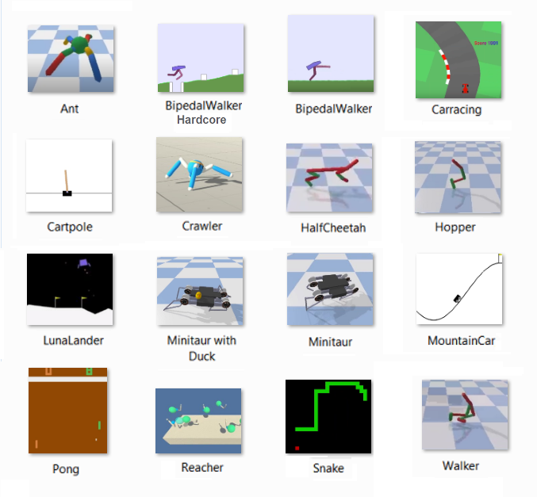
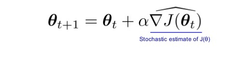

## Deep Reinforcement Learning Algorithms

This collection showcases various projects focused on Deep Reinforcement Learning techniques.
The projects are organized in a matrix structure: [environment x algorithm], where
environment represents the challenge to be tackled, and algorithm denotes the
method employed to solve it. In certain instances, multiple algorithms are applied to
the same environment. Each project is presented as a Jupyter notebook, complete with
a comprehensive training log.

The collection encompasses the following environments:

__AntBulletEnv__,  __BipedalWalker__, __BipedalWalkerHardcore__, __CarRacing__, __CartPole__, __Crawler__, __HalfCheetahBulletEnv__,   
__HopperBulletEnv__,  __LunarLander__,  __LunarLanderContinuous__,  __Markov Decision 6x6__,  __Minitaur__, __Minitaur with Duck__,      
__MountainCar__, __MountainCarContinuous__, __Pong__, __Navigation__, __Reacher__,  __Snake__,  __Tennis__, __Waker2DBulletEnv__.   

Four environments (__Navigation__,  __Crawler__, __Reacher__,  __Tennis__) are solved in the framework of the   
[**_Udacity Deep Reinforcement Learning Nanodegree Program_**](https://www.udacity.com/course/deep-reinforcement-learning-nanodegree--nd893).  
 
* [_Monte-Carlo Methods_](https://medium.com/@zsalloum/monte-carlo-in-reinforcement-learning-the-easy-way-564c53010511)       
In Monte Carlo (MC) methods, we play through episodes of the game until completion, collect the rewards along the way, and then trace back to the start of the episode. This process is repeated multiple times, and the average value of each state is calculated. 
* [_Temporal Difference Methods and Q-learning_](https://en.wikipedia.org/wiki/Temporal_difference_learning)
* [_Reinforcement Learning in Continuous Space (Deep Q-Network)_](https://en.wikipedia.org/wiki/Reinforcement_learning)
* [_Function Approximation and Neural Network_](https://medium.com/biffures/rl-course-by-david-silver-lectures-5-to-7-576188d3b033)    
The [Universal Approximation Theorem (UAT) states](https://towardsdatascience.com/the-approximation-power-of-neural-networks-with-python-codes-ddfc250bdb58) The Universal Approximation Theorem (UAT) states that feed-forward neural networks with a single hidden layer and a finite number of nodes can approximate any continuous function, given certain mild assumptions about the activation function are met.
* [_Policy-Based Methods_](https://towardsdatascience.com/policy-based-reinforcement-learning-the-easy-way-8de9a3356083), [_Hill-Climbing_](https://en.wikipedia.org/wiki/Hill_climbing), [_Simulating Annealing_](https://medium.com/@macromoltek/machine-learning-and-simulated-annealing-588b2e70d0cc)     
Random-restart hill-climbing is often surprisingly effective. Simulated annealing is a useful probabilistic technique because it avoids mistaking local extrema for global extrema.

* [_Policy-Gradient Methods_](https://lilianweng.github.io/lil-log/2018/04/08/policy-gradient-algorithms.html), [_REINFORCE_](https://medium.com/samkirkiles/reinforce-policy-gradients-from-scratch-in-numpy-6a09ae0dfe12), [_PPO_](https://arxiv.org/abs/1707.06347)    
Define a performance measure _J(\theta)_ to maximaze. Learn policy paramter \theta throgh _approximate gradient ascent_.    

* [_Actor-Critic Methods_](https://towardsdatascience.com/soft-actor-critic-demystified-b8427df61665), [_A3C_](https://medium.com/emergent-future/simple-reinforcement-learning-with-tensorflow-part-8-asynchronous-actor-critic-agents-a3c-c88f72a5e9f2), [_A2C_](https://hackernoon.com/intuitive-rl-intro-to-advantage-actor-critic-a2c-4ff545978752), [_DDPG_](https://medium.com/@amitpatel.gt/policy-gradients-1edbbbc8de6b), [_TD3_](https://arxiv.org/abs/1802.09477), [_SAC_](https://towardsdatascience.com/soft-actor-critic-demystified-b8427df61665)    
The key difference from A2C is the asynchronous aspect. A3C involves multiple independent agents (networks) with their own weights, interacting with different copies of the environment in parallel, thus exploring a larger part of the state-action space more quickly.
* [_Forward-Looking Actor or FORK_](https://arxiv.org/abs/2010.01652)    
Model-based reinforcement learning leverages the model in a sophisticated manner, often utilizing deterministic or stochastic optimal control theory to optimize the policy based on the model. FORK uses the system network as a black box to predict future states, without using it as a mathematical model for optimizing control actions. This distinction allows any model-free Actor-Critic algorithm with FORK to remain model-free.
# Deep-Learner
